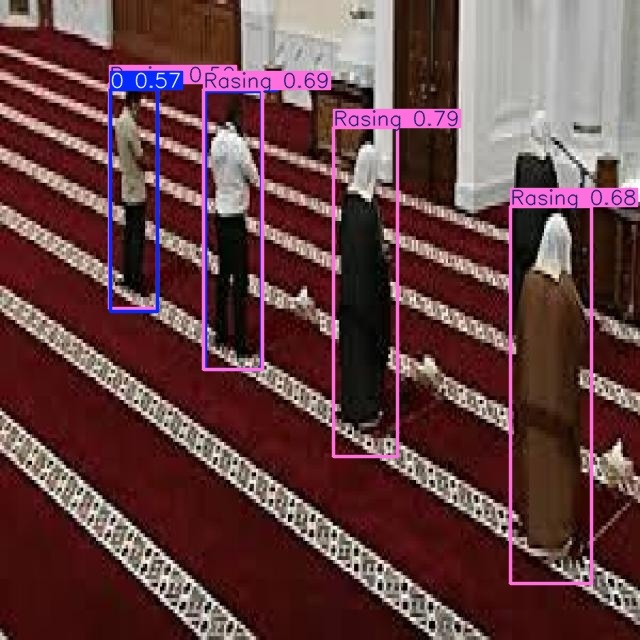

# YOLOv11 Prayer Prediction

This repository contains the code for training and predicting prayer movements using the YOLOv11 model.


## Table of Contents
- [Project Overview](#project-overview)
- [Model Training](#model-training)
- [Model Prediction](#model-prediction)
- [Requirements](#requirements)
- [How to Use](#how-to-use)
- [Acknowledgements](#acknowledgements)

## Project Overview
This project is focused on predicting prayer postures using a custom-trained YOLOv11 model. The model is trained to detect specific prayer postures from input images.

## Model Training
The model was trained on a custom dataset containing images of different prayer postures. The YOLOv11 framework was used for training.

## Model Prediction
To run predictions on images, the following command can be used:

```bash
!yolo task=detect mode=predict model='best.pt' conf=0.25 source='image.jpg' save=True
```

This command loads the `best.pt` model and predicts objects in the input image with a confidence threshold of 25%. The predictions are saved locally.

## Requirements

- Python 3.x
- PyTorch
- YOLOv11

You can install the required dependencies using:

```bash
pip install -r requirements.txt
```

## How to Use

1. Clone the repository:
   ```bash
   git clone https://github.com/alihassanml/Yolo11-Prayer-Prediction.git
   cd Yolo11-Prayer-Prediction
   ```

2. Ensure that your trained model file (`best.pt`) is in the root directory.

3. Run predictions using the provided script:
   ```bash
   !yolo task=detect mode=predict model='best.pt' conf=0.25 source='path_to_your_image' save=True
   ```

4. The output will be saved with the predictions drawn on the input image.

## Acknowledgements
- This project utilizes the YOLOv11 model for object detection.
- Special thanks to the contributors of the YOLOv5 and YOLOv11 frameworks.

## License
This project is licensed under the MIT License - see the LICENSE file for details.
